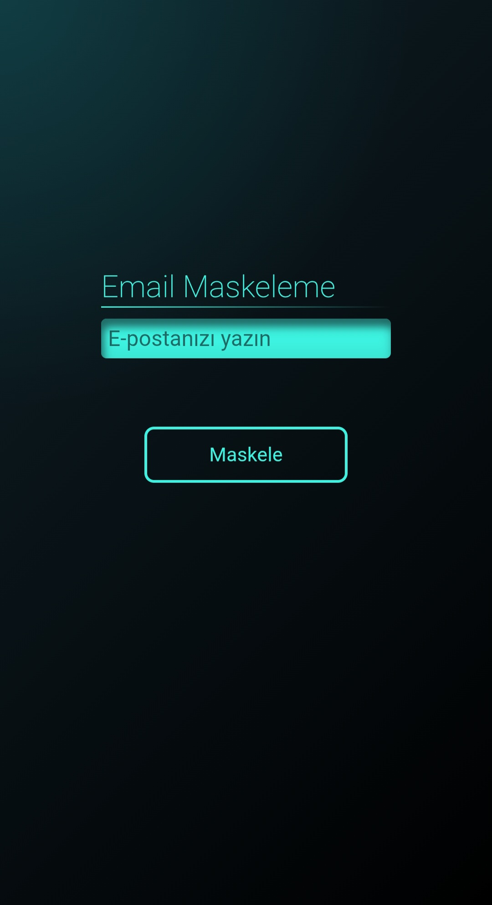
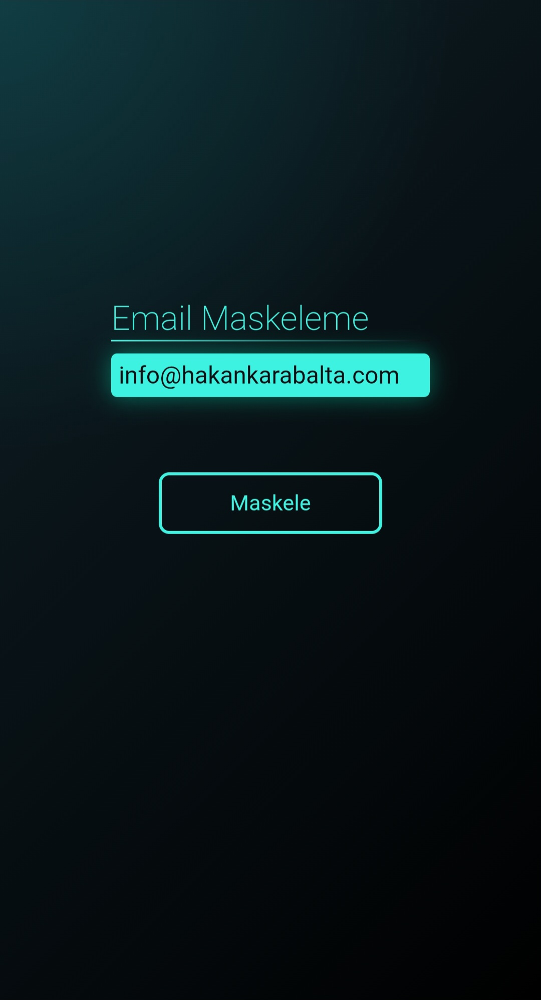
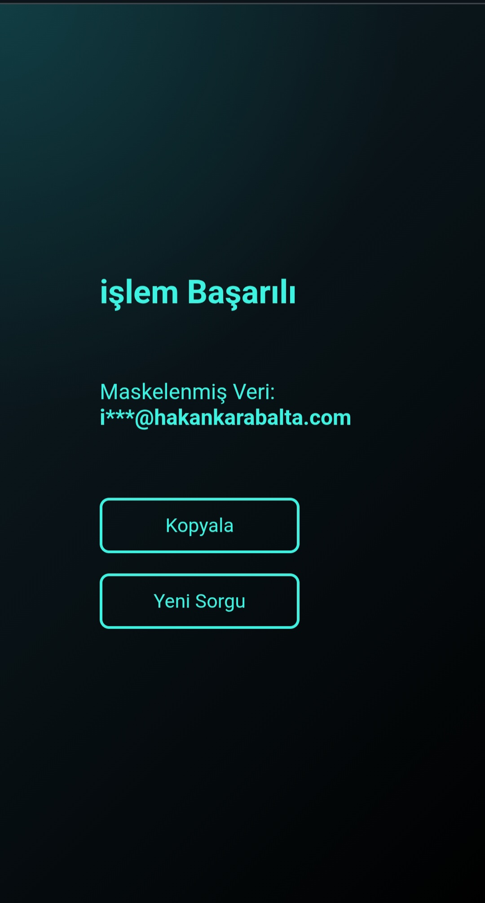

# 📧 Email Masking Tool

A sleek and modern web application built with JavaScript to protect user privacy by masking email addresses. This tool automatically obscures sensitive parts of an email while keeping the essential format visible.

## 📸 Screenshots

Here is a look at the application interface and workflow:

| 1. Landing Page | 2. Data Entry | 3. Result Screen |
| :---: | :---: | :---: |
|  |  |  |
| *Initial State* | *Entering Email* | *Masked Output* |

## ✨ Features
- 🛡️ **Data Privacy:** Automatically masks email characters with asterisks (`*`) to prevent data leakage.
- 🎨 **Neon UI Design:** A stylish dark-themed interface with neon glowing effects for a modern look.
- ⚡ **Real-time Processing:** Fast and lightweight string manipulation using Vanilla JavaScript.
- 📱 **Fully Responsive:** Optimized for both mobile and desktop screens.

## 🛠️ Built With
- **HTML5**
- **CSS3** (Custom Neon Styling)
- **JavaScript (ES6+)**

## 🚀 Getting Started
1. Clone the repository:
   ```bash
   git clone [https://github.com/yourusername/email-masking-js.git](https://github.com/yourusername/email-masking-js.git)
